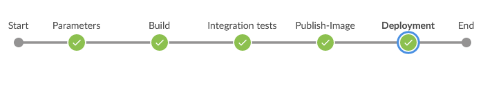
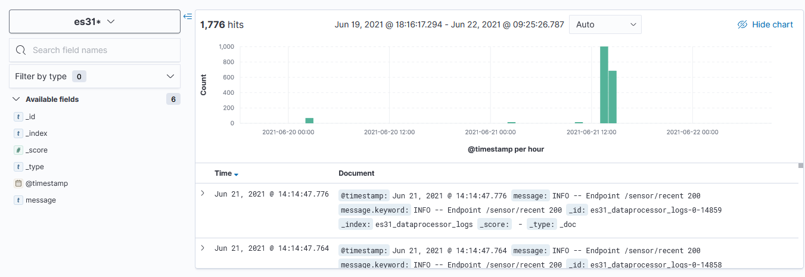

# Perspetiva do desenvolvedor

## Implementação

Na tabela seguinte, estão presentes as componentes que constituem o sistema assim como informações sobre as mesmas:

<table style="width:90%">
 <tr>
   <th>Componente</th>
   <th>Informação</th>
   <th>Ambiente de runtime</th>
 </tr>
 <tr>
   <td>Webapp</td>
   <td>A webapp desenvolvida em React permite ao utilizador verificar um histórico de dados e de alertas, assim como configurar regras para o envio de comandos</td>
   <td>A aplicação corre num container de docker, acessível pelo endereço 192.168.160.87 e porto 31004</td>
 </tr>
 <tr>
   <td>DataProcessor</td>
   <td>Microsserviço desenvolvido em Spring que tem por objetivo processar os dados armazenados no Influx, assim como os alertas, e expor estes em endpoints REST</td>
   <td>O microsserviço corre num container de docker, acessível pelo endereço 192.168.160.87 e porto 31003</td>
 </tr>
 <tr>
   <td>Management</td>
   <td>Microsserviço desenvolvido em Spring que tem por objetivo receber regras da Webapp através de endpoints REST, garantir a persistência destas regras e fazer decisões com base nas regras armazenadas e dados dos sensores consumidos, de modo a produzir comandos para um tópico de Kafka</td>
   <td>O microsserviço corre num container de docker, acessível pelo endereço 192.168.160.87 e porto 31005</td>
 </tr>
 <tr>
   <td>Grafana</td>
   <td>Interface de visualização de dashboards, utilizada para a visualização dos dados dos sensores em gráficos, assim como para a configuração de alertas</td>
   <td>A aplicação corre num container de docker, acessível pelo endereço 192.168.160.87 e porto 31002</td>
 </tr>
</table>

Pontos a ter em atenção:
- A casa virtual (REST API em Spring) e o gerador dos dados sensoriais (Cliente MQTT em Java) apesar de terem sido desenvolvidos, não são considerados parte do sistema, e como tal não aparecem na tabela.
- O Kafka foi utilizado e permite aos vários componentes comunicarem e funcionarem com base numa arquitetura baseada em eventos, em que os eventos podem representar novos dados sensoriais, alertas ou novos comandos.
- Muitas operações não precisaram de microsserviços pois foram utilizados vários "Kafka connectors" que permitiram automatizar certos processos.   

## Extensões e modificações sobre o sistema

- A utilização do Kafka e de uma arquitetura baseada em eventos permite facilmente escalar o sistema com a introdução de novos microsserviços e aplicações.
- No repositório SafeHouse nos diretórios data-processor e management estão presentes as implementações dos respetivos microsserviços Spring. Estes usam um RestController, pelo que é trivial a adição de novos endpoints. De realçar também o ficheiro application.properties que contém as configurações do Kafka e base de dados (no caso do management).

# Perspetiva de operações

## Pipeline

Na imagem em baixo e na tabela seguinte, estão presentes as "stages" do pipeline do Jenkins e alguns detalhes:

<table style="width:90%">
 <tr>
   <th>Stage</th>
   <th>Procedimentos</th>
   <th>Objetivo</th>
 </tr>
 <tr>
   <th>Build</th>
   <th>mvn clean install -DskipTests</th>
   <th>Instalação automática do artefacto do microsserviço, o seu POM e de artefactos necessários</th>
 </tr>
 <tr>
   <th>Integration tests</th>
   <th>mvn test -Pintegration</th>
   <th>Execução dos testes de integração desenvolvidos com o auxílio da ferramenta Cucumber</th>
 </tr>
 <tr>
   <th>Maven-Deploy</th>
   <th>mvn deploy -f pom.xml -s settings.xml</th>
   <th>Deploy do artefacto da aplicação para o artifactory</th>
 </tr>
 <tr>
   <th>Publish-Image</th>
   <th>docker build e docker push</th>
   <th>Build das imagens docker das aplicações e push para o repositório Docker</th>
 </tr>
 <tr>
   <th>Deployment</th>
   <th>docker pull, docker create e docker start</th>
   <th>Ligação por ssh à Playground VM, de modo a fazer pull das imagens docker e a sua execução no respetivo ambiente</th>
 </tr>
</table>

## Monitorização

A monitorização do sistema é feito através da coleção de logs da aplicação DataProcessor que são enviados para um tópico de Kafka, e consequentemente é usado um connector de Kafka que a faz a ligação e o parse entre os logs presentes no Kafka e a instância de ElasticSearch.

