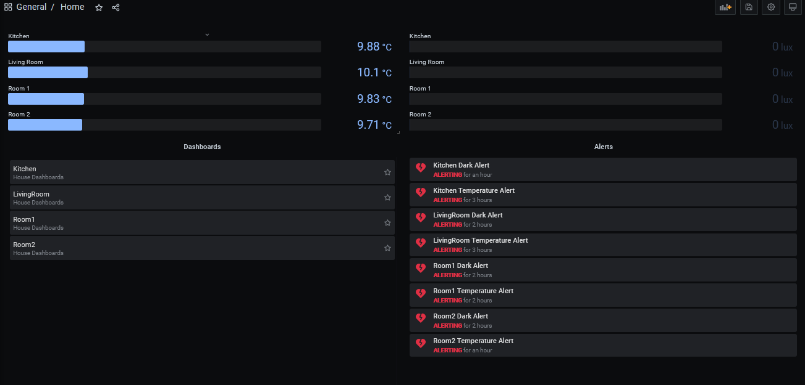
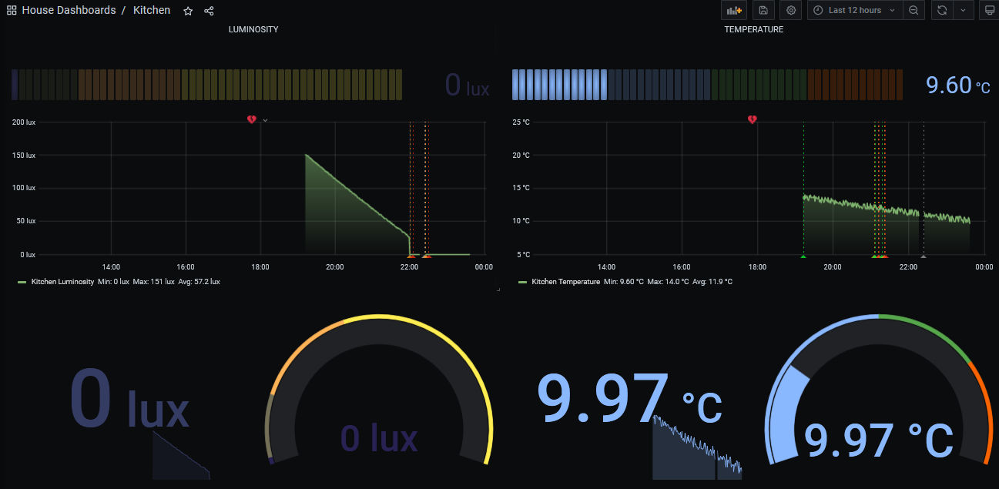
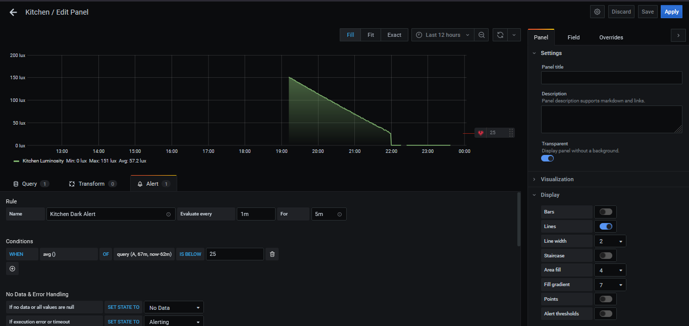

# Manual UI

## Webapp

### Valores dos sensores em Tempo Real
                                                                                                                                                                      

  
  
#### Página principal que contém os valores dos sensores para todas as divisões, atualizando a cada 5 segundos.

***

### Dados dos sensores da última hora
  
  

  
  
#### Tabela com os dados de todos os sensores de uma divisão com um minuto de intervalo.

***

### Notificações
                                                                                                                                                                                                                                                                                                                              

  
  
#### Botão que apresenta o número de notificações, ou seja avisos de sensores cujo o valor não obedece a uma regra criada, com um dropdown indicando a divisão, a métrica relevante e o seu estado.

***

### Página de settings
  
  

  
  
#### É apresentada uma tabela que contém todas as regras criadas, com a possibilidade de as apagar diretamente, e um campo onde se pode criar uma regra, preenchendo a informação necessária.
### Descrição dos campos:
- Divisão onde o qual reside o sensor
- A métrica para a qual se vai aplicar a regra
- O valor númerico crítico da métrica a controlar, irá dispoletar uma notificação caso o valor do sensor seja superior/inferior
- O sentido da comparação com o valor limite estabelecido
- O disposito que queremos que realize uma ação caso a regra seja quebrada
- O valor que representa a ação do dispositivo atuador

## Grafana

### Dashboards e Alertas configurados
                                                                                                                                                                      

  
  
#### Página principal que contém os últimos valores sensoriais, assim como a lista das dashboards e alertas existentes.

***

### Dashboard de uma divisão
                                                                                                                                                                      

  
  
#### Página que contém painéis com dados relativos a uma divisão.

***

### Configuração de alertas
                                                                                                                                                                      

  

#### A edição de um gráfico, permite a configuração de um alerta para os dados em questão.
